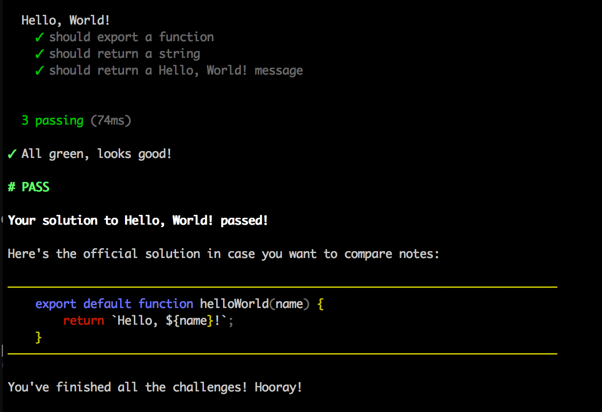

Workshopper course for strongloop and loopback
==========

This is a beginner Strongloop workshop for newbies at Soluciones Drag & Drop. It covers:

* Models
* Remote hooks and Operation hooks
* Remote methods
* Relations

1. Install [Node.js](http://nodejs.org/)
2. Run `npm install -g stronger-loop`
3. Run `stronger-loop`
4. **.. profit!**

## Credits
This was inspired and based on the (workshopper-mocha-boilerplate)([https://github.com/ThibWeb/workshopper-mocha-boilerplate) repo.
